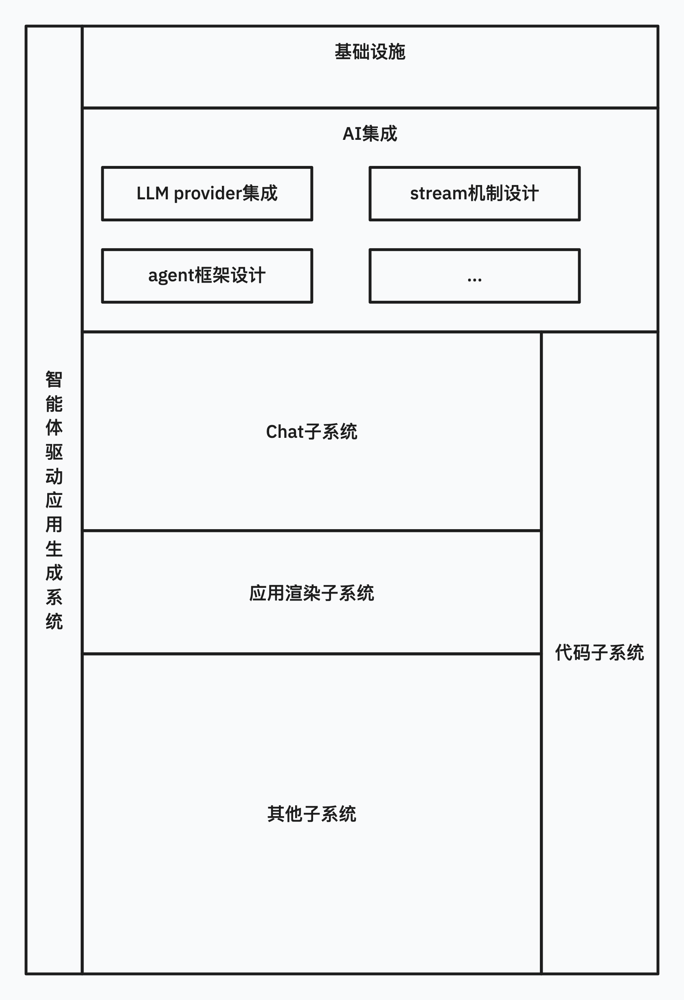
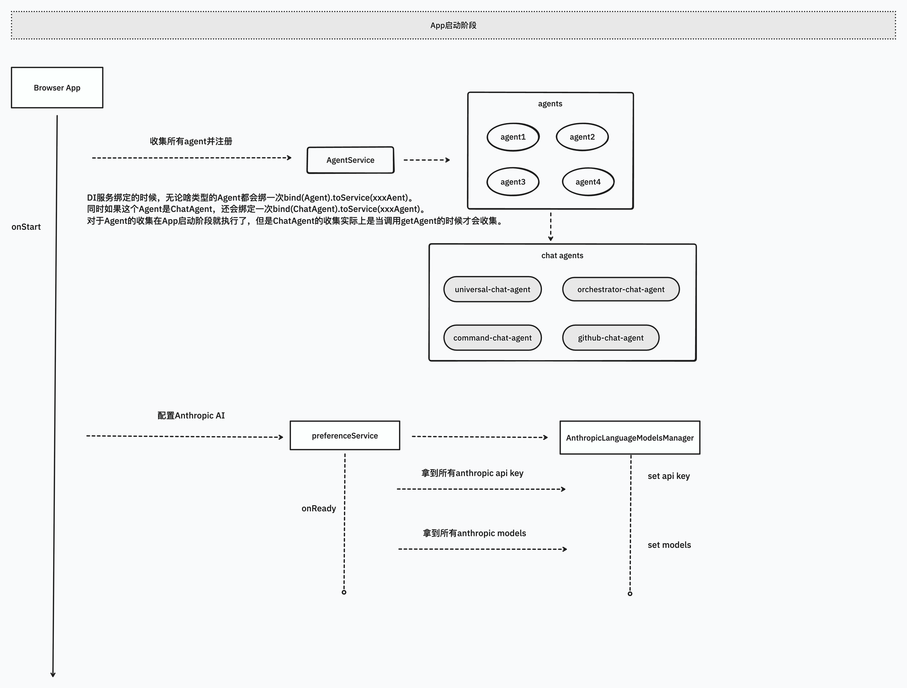

# Mini Atoms

## 想啊想

### 竞品分析

在软件行业也以各种方式摸索了小几年，收到这份任务时我的第一直觉是去搜索这个产品的相关竞品，而不是去做这个demo的需求分析。诸如像Atoms这样的任何一款优秀的产品出现在大众的眼中，经历过项目创业和独立开发的我相信必定会有同类型的产品出世，只不过是大或小，粗或糙。最终我找到了lovable这个玩意，它的想法跟atoms十分类似，虽然我不知道个体差异，但是我可以通过观察这两者的产品介绍和视频去了解相关的流程和特点。

### 开源分析

那软件行业有闭源就必定有开源，好像Manus对应的有OpenManus，大家都会尝试复刻或者走同一条路研究某个先进的东东。于是我让AI帮我找，找到了一个开源项目是`https://github.com/stackblitz/bolt.new`。（ps：听说lovable好像就是基于这个开发的不知道是真是假）。因此更深一步，我开始初步拆分需求，发现从大体框架来说如果没有AI，好像也可以做同样的事，只不过需要人来干这件事而已。那业界似乎各种IDE都有预览功能，我刚好手上也有在基于某个IDE框架研究的活，那只需要将流程做个编排，改造下就能得到一个初版的MVP。基于巨人肩膀前进对我来说能够快速得到更好的验证。

## 画呀画

### 系统分析

整个系统我的设计如上图所示，业务核心就是：“生成代码” -> “渲染代码”。因此**代码子系统**就是作为整个业务主线贯穿整个系统的，另外一头**Chat子系统**负责输出代码，**应用渲染子系统**负责接收代码。其他流程都是剩余的完善与丰富，或者说是流程编排的一部分。

当然，上面只是核心的设计，实际上我看了下完整的工作流其实就是人类世界团队合作开发一个项目的工作流，涉及到需求分析->架构设计->UI设计->代码开发->应用测试->应用发布整个流程。

### 模块方案

- Chat子系统：AI IDE大都有的，这个项目的整个通讯基底都是RPC，也是以一个全栈视角来开发的。Chat子系统的设计核心方案是Chat独立ChatAgent与LLM能力拆分，因为考虑到LLM需要适配多LLM Provider。大体的设计框架和流程，我画了两张张图如下：

  

- 应用渲染系统、代码子系统

  时间有限这两个目前demo阶段比较简单，核心就是应用iframe渲染，然后找个地方放。

### 迭代思考

当前我只不过是实现了一个勉强走通的demo，但是发现如果真的需要上生产，需要的最终产物我觉得应该是一套类似于人类写的源码。这份源码作为交付产物，人类能写什么样的工程，AI的交付应该也是靠近这块的。这就分两块思考，一个是小白用户，那么你完全可以让AI交付bundle产物，因为这类用户要的就是点子验证；但如果是企业用户、程序员用户你用某个框架写了一个项目，那么AI最好也要用这个框架写出来一样的项目，因为他们需要接收的是一个外包团队为他们写的产品，他们还可以自己继续写代码迭代，除非哪一天AI强大到一个复杂大型项目能hold住为止。这就涉及到切分AI生成的代码等软件工程问题了。另外一个就是我的体会下来设计就是一个Session最好对应一个App的创作，它能最简单有效保障创作连续性，但是其实我也不知道为啥我的AI连续创作老出问题，后头我研究看看。多Session会话的设计我这边设计如上图里有，就是Chat Model的包装而已。不过在LLM层也有一个Session，这个是作为审计日志使用的。前者是用户层的东东，后者是开发者内部看的东东。一Session对应多App创作其实也并非不行，不过就复杂的多，涉及到AI意图识别：你咋知道用户是基于上一个APP继续创作还是想新创建一个新的APP？这都是我实际体验下的一些思考难点吧。

## 结语

这次take home asignment是一个有趣的经历，刚好我在IDE框架研究上有些眉目借着这次机会也有了不一样的视角思考。感谢Atoms团队，感谢社区的每一款优秀的产品，祝好，best regards！

